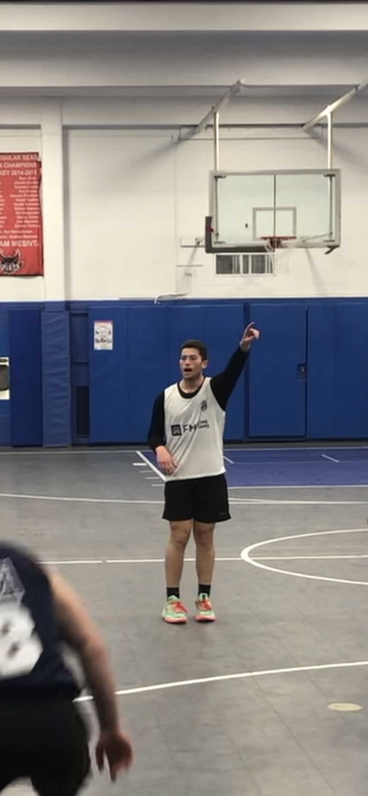

<!DOCTYPE html>
<html lang="en">
<head>
<meta charset="UTF-8">
<meta name="description" content="Yoni's Sports Training for all sports and all ages in Lawrence, NY. Book private sessions.">
<meta name="keywords" content="Yoni, Sports Training, Basketball, Football, Private Coaching, Lawrence NY">
<meta name="author" content="Yoni Bobker">
<meta name="viewport" content="width=device-width, initial-scale=1.0">
<title>Yoni's Sports Training</title>

</head>
<body>
<header>
<h1>Yoni's Sports Training</h1>

Lawrence, NY 11559 | All Sports, All Ages

</header>

<h2>1-on-1 Private Training</h2>

$75 for 1-on-1

$90 for 2 kids

$15 for each additional child (up to 6)

<a href="mailto:yonibobker@gmail.com?subject=Book Training Session&body=Hi Yoni,%0D%0AI'd like to book a training session on [insert date and time].%0D%0AThanks!" target="_blank">
<button class="book-button">Book a Session</button>
</a>

Contact: +1 516-666-0292 | Email: <a href="mailto:yonibobker@gmail.com">yonibobker@gmail.com</a>

</body>
</html>
